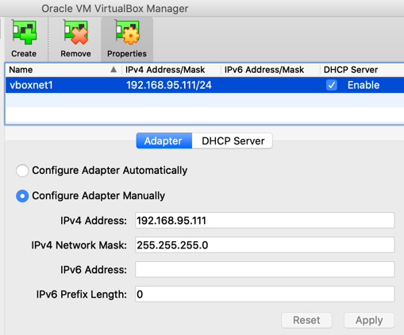

# GRFICSv3

This is version 3 of the Graphical Realism Framework for Industrial Control Simulation (GRFICS).

### Overview

This version of GRFICS is organized as four VirtualBox VMs (a 3D simulation, a soft PLC, an HMI, and a workstation) communicating with each other on a host-only virtual network. For a more detailed explanation of the entire framework and some background information on ICS networks, please refer to the workshop paper located at https://www.usenix.org/conference/ase18/presentation/formby.

A video series walking through VM setup and example attacks for GRFICSv2 is
available on the Fortiphyd YouTube channel at 
https://www.youtube.com/playlist?list=PL2RSrzaDx0R670yPlYPqM51guk3bQjFG5.
Parts of it apply to GRFICSv3.

A commercial version of GRFICS with more scenarios, advanced features, and streamlined usability is being offered by Fortiphyd Logic. Find out more at https://www.fortiphyd.com/training.

### GRFICSv3 vs. GRFICSv2

GRFICSv3 is a fork of [GRFICSv2](https://github.com/Fortiphyd/GRFICSv2) with the following changes:

* The pfSense VM is removed.
* The Workstation VM is upgraded from Ubuntu 16.04 to 20.04 and has software useful for launching attacks against the PLC installed.
* The HMI VM has extra packages installed to ease debugging.
* The ICS and DMZ networks are merged into a single network that all VMs connect to.

### Simulation

The simulation VM (named ChemicalPlant) runs a realistic simulation of a chemical process reaction that is controlled and monitored by simulated remote IO devices through a simple JSON API. These remote IO devices are then monitored and controlled by the PLC VM using the Modbus protocol. This VM is assigned IP addresses 192.168.95.10-15.

### Programmable Logic Controller

The PLC VM (named plc_2) is a modified version of OpenPLC (https://github.com/thiagoralves/OpenPLC_v2) that uses an older version of the libmodbus library with known buffer overflow vulnerabilities. This VM is assigned IP address 192.168.95.2.

### Human Machine Interface

The HMI VM (named ScadaBR) primarily contains an operator HMI created using the free ScadaBR software. This HMI is used to monitor the process measurements being collected by the PLC and send commands to the PLC. This VM is assigned IP address 192.168.95.5.

### Workstation

The workstation VM is an Ubuntu 20.04 machine with software used for launching an attack. This VM is assigned IP address 192.168.95.6.

#### Installing from scratch

1. Download and install the latest version of [VirtualBox](https://www.virtualbox.org/wiki/Downloads).

2. [Create a host-only interface](https://www.virtualbox.org/manual/ch06.html#network_hostonly) in VirtualBox that's assigned the 192.168.95.111/24 IP address.

3. Download ISO images for the 64-bit server versions of [Ubuntu 16.04](https://releases.ubuntu.com/16.04/) and the 64-bit workstation version of [Ubuntu 20.04](https://releases.ubuntu.com/20.04/).

4. See instructions for each VM in corresponding directories.

#### Pre-built VMs

1. Download VMs:

   - [Simulation VM](https://netorgft4230013-my.sharepoint.com/:u:/g/personal/dformby_fortiphyd_com/EaBeAxbF6xtEumdsJ7npVz0BeECJnseAMsfAbaLwV3sKOg?e=JRvkcS) - MD5=02af6c2502ecaab6c6d138deb560b27d
   - [HMI VM](https://www.mattrideout.com/courses/cs6263/GRFICSv3/ScadaBR.ova) - MD5=b951f5fbd896ace762537207de913393
   - [PLC VM](https://netorgft4230013-my.sharepoint.com/:u:/g/personal/dformby_fortiphyd_com/ER0pG_X5IRNCg477jf2ppo8BdN0t13t9vrNBH92_oOWOHA?e=hNeJ88) - MD5=0fbb1254fb166466496f2a48780ae774
   - [Workstation VM](https://www.mattrideout.com/courses/cs6263/GRFICSv3/workstation.ova) - MD5=8b41ee6597404b7c9e9acf7c2b1c3866

2. [Add a host-only adapter](https://www.virtualbox.org/manual/ch06.html#network_hostonly) in VirtualBox that's assigned 192.168.95.111/24.

  Your VirtualBox settings should look something like the below screenshot, although the name will likely differ:

  

3. Import each VM into VirtualBox using File->Import Appliance.

4. Go into each VM's network settings, and attach each network adapter to 192.168.95.111/24 network.

5. Start all the VMs.

6. VM credentials:
    - Simulation (Chemical Plant): simulation | Fortiphyd
    - HMI (ScadaBR): scadabr | scadabr    web console: admin | admin
    - PLC: user | password
    - Workstation: workstation | workstation

7. If you downloaded the simulation VM, it should start on boot. If not, log into it and open 2 terminals. In one, cd into the `~/GRFICSv2/simulation_vm/simulation` directory and run `./simulation`. In the second terminal, cd into the `~/GRFICSv2/simulation_vm/simulation/remote_io/modbus` directory and run `sudo bash run_all.sh`.

8. If you downloaded the PLC VM, it should start on boot. If not, log into it, cd into the `OpenPLC_v2` directory, and run `sudo nodejs server.js`.

9. Go to [http://192.168.95.10](http://192.168.95.10/) to view the visualization.
