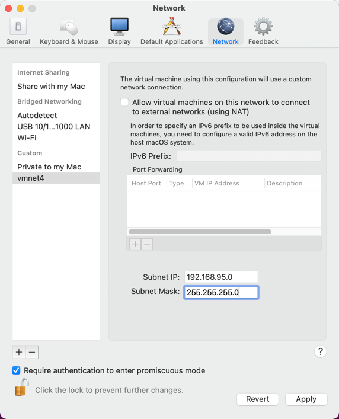

# GRFICSv3 with VMWare Fusion

The [README](README.md) assumes that [VirtualBox](https://www.virtualbox.org/wiki/Downloads) is used for virtualization. Some macOS users prefer [VMWare Fusion](https://www.vmware.com/products/fusion.html), so this document shows how to use it instead of VirtualBox.

The VirtualBox issues that are sometimes resolved by switching to VMWare Fusion include:

1. Performance issues.
2. Duplicate keystrokes being registered.
3. Networking issues that prevent some TCP sessions from being established but still allow ICMP traffic, such as ping.

Here's the procedure for importing the VMs into VMWare Fusion:

1. Add a new private network by going to VMWare Fusion->Preferences->Network->Padlock->+, then entering a Subnet IP of `192.168.95.0`, and a Subnet Mask of `255.255.255.0`:

  

  Note the new network's name (`vmnet4` in the screenshot above). You'll use it when you import VMs.

2. Download each of the pre-build VMs listed in the [README](README.md).

3. Import each VM into VMWare Fusion by using File->Import. When you get to the Finish Screen, click "Customize Settings".

4. Click on "Network Adapter", select the private network that you created earlier (vmnet4 in the previous screenshot), then close the preferences window.

5. Boot each VM, and if needed, change its network configuration to use the new network card. For most VMs, this means running `ip addr` to see if the IP(s) are already bound to the correct network interface, and if not, editing `/etc/network/interface` to fix the configuration. Reboot each VM to apply the updated configuration.

